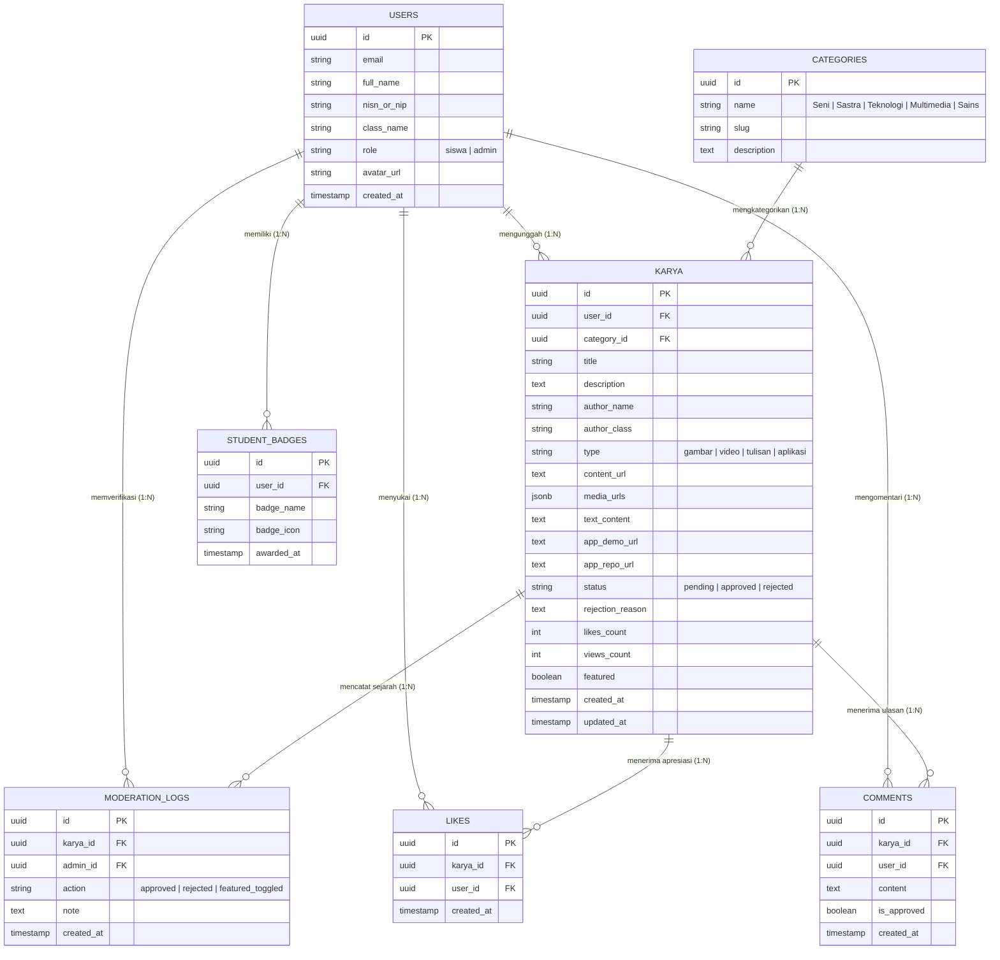

# Entity Relationship Diagram (ERD)
## Mading Online Karya Siswa

Dokumen ini berisi rancangan **Entity Relationship Diagram (ERD)** dan **Skema Database PostgreSQL / InsForge** untuk aplikasi **Mading Online Karya Siswa** berdasarkan spesifikasi pada [PRD Document](file:///d:/mading/prd.md).

---

## 1. Visual ERD Diagram (Mermaid)



---

## 2. Table Specifications & Release Versioning

### 🔴 Core Tables (MVP v1.0)

#### 1. `users` (Pengguna Platform)
Menyimpan data identitas siswa dan admin/guru.
- `id` (`UUID`, PK, Default: `gen_random_uuid()`)
- `email` (`VARCHAR(255)`, UNIQUE, NOT NULL)
- `full_name` (`VARCHAR(150)`, NOT NULL)
- `nisn_or_nip` (`VARCHAR(50)`, NULL)
- `class_name` (`VARCHAR(50)`, NULL - contoh: `XII IPA 1`)
- `role` (`VARCHAR(20)`, NOT NULL, Default: `'siswa'`) — Enum: `'siswa'`, `'admin'`
- `avatar_url` (`TEXT`, NULL)
- `created_at` (`TIMESTAMPTZ`, Default: `NOW()`)

#### 2. `categories` (Kategori Karya)
Kategori tematik mading sekolah.
- `id` (`UUID`, PK)
- `name` (`VARCHAR(100)`, NOT NULL) — Contoh: *Seni*, *Sastra*, *Teknologi*, *Multimedia*, *Sains*
- `slug` (`VARCHAR(100)`, UNIQUE, NOT NULL)
- `description` (`TEXT`, NULL)

#### 3. `karya` (Karya Siswa - Utama)
Tabel utama penyimpan karya siswa dengan 4 format media (Gambar, Video, Tulisan, Aplikasi).
- `id` (`UUID`, PK)
- `user_id` (`UUID`, FK -> `users.id`, NULLable untuk anonim/guest test)
- `category_id` (`UUID`, FK -> `categories.id`, NULLable)
- `title` (`VARCHAR(255)`, NOT NULL)
- `description` (`TEXT`, NULL)
- `author_name` (`VARCHAR(150)`, NOT NULL)
- `author_class` (`VARCHAR(50)`, NOT NULL)
- `type` (`VARCHAR(20)`, NOT NULL) — Enum: `'gambar'`, `'video'`, `'tulisan'`, `'aplikasi'`
- `content_url` (`TEXT`, NULL) — Link image/video utama
- `media_urls` (`JSONB`, Default: `'[]'`) — Galeri multi-foto/lampiran
- `text_content` (`TEXT`, NULL) — Isi artikel/puisi/cerpen
- `app_demo_url` (`TEXT`, NULL) — Tautan Live Demo Aplikasi
- `app_repo_url` (`TEXT`, NULL) — Tautan Source Code GitHub
- `status` (`VARCHAR(20)`, Default: `'pending'`) — Enum: `'pending'`, `'approved'`, `'rejected'`
- `rejection_reason` (`TEXT`, NULL) — Masukan admin jika ditolak
- `likes_count` (`INT`, Default: `0`)
- `views_count` (`INT`, Default: `0`)
- `featured` (`BOOLEAN`, Default: `FALSE`) — Pin ke Hero Banner
- `created_at` (`TIMESTAMPTZ`, Default: `NOW()`)
- `updated_at` (`TIMESTAMPTZ`, Default: `NOW()`)

#### 4. `moderation_logs` (Audit Log Moderasi Admin)
Mencatat riwayat verifikasi yang dilakukan oleh admin.
- `id` (`UUID`, PK)
- `karya_id` (`UUID`, FK -> `karya.id`, ON DELETE CASCADE)
- `admin_id` (`UUID`, FK -> `users.id`)
- `action` (`VARCHAR(30)`, NOT NULL) — Enum: `'approved'`, `'rejected'`, `'featured_toggled'`
- `note` (`TEXT`, NULL)
- `created_at` (`TIMESTAMPTZ`, Default: `NOW()`)

---

### 🔵 Interactivity Tables (Release v1.1)

#### 5. `likes` (Apresiasi Karya)
- `id` (`UUID`, PK)
- `karya_id` (`UUID`, FK -> `karya.id`, ON DELETE CASCADE)
- `user_id` (`UUID`, FK -> `users.id`, ON DELETE CASCADE)
- `created_at` (`TIMESTAMPTZ`, Default: `NOW()`)
- *Constraint:* `UNIQUE(karya_id, user_id)` (Mencegah double like)

#### 6. `comments` (Ulasan Komunitas)
- `id` (`UUID`, PK)
- `karya_id` (`UUID`, FK -> `karya.id`, ON DELETE CASCADE)
- `user_id` (`UUID`, FK -> `users.id`, ON DELETE CASCADE)
- `content` (`TEXT`, NOT NULL)
- `is_approved` (`BOOLEAN`, Default: `TRUE`)
- `created_at` (`TIMESTAMPTZ`, Default: `NOW()`)

---

### 🟡 Gamification Tables (Release v1.2)

#### 7. `student_badges` (Lencana Prestasi)
- `id` (`UUID`, PK)
- `user_id` (`UUID`, FK -> `users.id`, ON DELETE CASCADE)
- `badge_name` (`VARCHAR(100)`, NOT NULL) — Contoh: *Artisan Sekolah*, *Tekno Inovator*
- `badge_icon` (`VARCHAR(50)`, NOT NULL)
- `awarded_at` (`TIMESTAMPTZ`, Default: `NOW()`)

---

## 3. SQL DDL Migration Script (InsForge PostgreSQL)

```sql
-- Create ENUM Types
CREATE TYPE user_role AS ENUM ('siswa', 'admin');
CREATE TYPE karya_type AS ENUM ('gambar', 'video', 'tulisan', 'aplikasi');
CREATE TYPE karya_status AS ENUM ('pending', 'approved', 'rejected');

-- 1. Users Table
CREATE TABLE users (
    id UUID PRIMARY KEY DEFAULT gen_random_uuid(),
    email VARCHAR(255) UNIQUE NOT NULL,
    full_name VARCHAR(150) NOT NULL,
    nisn_or_nip VARCHAR(50),
    class_name VARCHAR(50),
    role user_role DEFAULT 'siswa' NOT NULL,
    avatar_url TEXT,
    created_at TIMESTAMPTZ DEFAULT NOW()
);

-- 2. Categories Table
CREATE TABLE categories (
    id UUID PRIMARY KEY DEFAULT gen_random_uuid(),
    name VARCHAR(100) NOT NULL,
    slug VARCHAR(100) UNIQUE NOT NULL,
    description TEXT
);

-- Seed Default Categories
INSERT INTO categories (name, slug, description) VALUES
('Seni & Desain', 'seni', 'Karya lukis, grafis, sketsa, dan ilustrasi siswa'),
('Sastra & Tulisan', 'sastra', 'Puisi, cerpen, esai, dan artikel populer'),
('Teknologi & Game', 'teknologi', 'Aplikasi web, game buatan siswa, dan proyek IT'),
('Multimedia & Video', 'multimedia', 'Video sinematik, animasi, dan vlog karya siswa'),
('Sains & Inovasi', 'sains', 'Karya ilmiah remaja dan eksperimen sains');

-- 3. Karya Table (Core MVP)
CREATE TABLE karya (
    id UUID PRIMARY KEY DEFAULT gen_random_uuid(),
    user_id UUID REFERENCES users(id) ON DELETE SET NULL,
    category_id UUID REFERENCES categories(id) ON DELETE SET NULL,
    title VARCHAR(255) NOT NULL,
    description TEXT,
    author_name VARCHAR(150) NOT NULL,
    author_class VARCHAR(50) NOT NULL,
    type karya_type NOT NULL,
    content_url TEXT,
    media_urls JSONB DEFAULT '[]'::jsonb,
    text_content TEXT,
    app_demo_url TEXT,
    app_repo_url TEXT,
    status karya_status DEFAULT 'pending' NOT NULL,
    rejection_reason TEXT,
    likes_count INT DEFAULT 0 NOT NULL,
    views_count INT DEFAULT 0 NOT NULL,
    featured BOOLEAN DEFAULT FALSE NOT NULL,
    created_at TIMESTAMPTZ DEFAULT NOW(),
    updated_at TIMESTAMPTZ DEFAULT NOW()
);

-- Indexes for Fast Query Performance
CREATE INDEX idx_karya_status ON karya(status);
CREATE INDEX idx_karya_type ON karya(type);
CREATE INDEX idx_karya_created_at ON karya(created_at DESC);
CREATE INDEX idx_karya_featured ON karya(featured) WHERE featured = TRUE;

-- 4. Moderation Logs Table
CREATE TABLE moderation_logs (
    id UUID PRIMARY KEY DEFAULT gen_random_uuid(),
    karya_id UUID REFERENCES karya(id) ON DELETE CASCADE,
    admin_id UUID REFERENCES users(id) ON DELETE SET NULL,
    action VARCHAR(30) NOT NULL,
    note TEXT,
    created_at TIMESTAMPTZ DEFAULT NOW()
);
```
